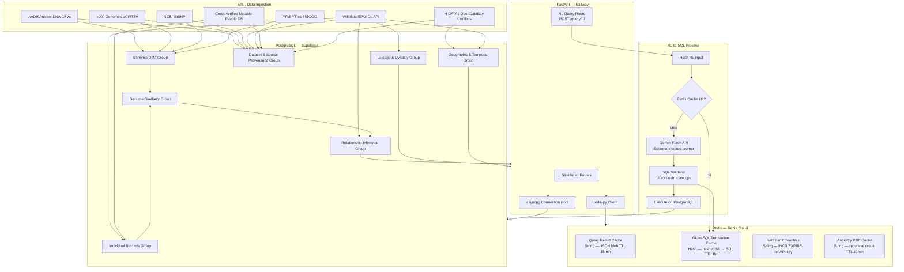
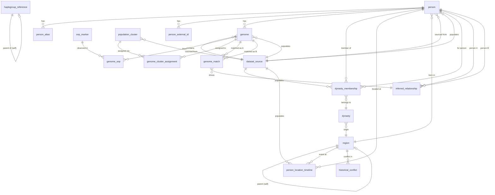

# Historical Figure Genetic Genealogy & Ancestry Mapper
## Phase 1 — Architecture Document

---

## 1. End-to-End Project Workflow

```
Phase 1: Schema Design & Dataset Sourcing
    ↓
Phase 2: PostgreSQL Setup (Supabase) — table creation, indexes, constraints
    ↓
Phase 3: ETL Pipeline — ingest from AADR, Wikidata, 1000 Genomes, NCBI dbSNP, etc.
    ↓
Phase 4: Redis Setup (Redis Cloud) — configure caching, rate limiting counters
    ↓
Phase 5: FastAPI Application — routes, asyncpg connection pool, redis-py client
    ↓
Phase 6: Query Layer — structured SQL templates + NL-to-SQL via Gemini Flash
    ↓
Phase 7: Similarity Scoring & Relationship Inference — batch compute jobs writing to DB
    ↓
Phase 8: Testing — unit tests per route, integration tests, query validation
    ↓
Phase 9: Deployment — Railway (FastAPI), Supabase (PostgreSQL), Redis Cloud
```

---

## 2. Full System Architecture — Mermaid Diagram



---

## 3. Complete Table Design — 18 Tables

Column names with exact PostgreSQL datatypes. No DDL.

---

### Group 1 — Individual Records

#### Table: `person`
Stores all individuals — both modern users and historical figures.

| Column | Type | Notes |
|---|---|---|
| person_id | UUID | PK, default gen_random_uuid() |
| full_name | TEXT | NOT NULL |
| birth_name | TEXT | alternate/birth name |
| is_historical | BOOLEAN | NOT NULL, default false |
| birth_year | INTEGER | BCE values stored as negative |
| death_year | INTEGER | NULL for living persons |
| birth_region_id | INTEGER | FK → region.region_id |
| gender | TEXT | CHECK IN ('male','female','unknown','other') |
| wikidata_qid | TEXT | UNIQUE, e.g. Q1234 |
| bio_text | TEXT | full biographical text |
| bio_tsv | TSVECTOR | generated from bio_text, for FTS |
| source_dataset_id | INTEGER | FK → dataset_source.dataset_id |
| created_at | TIMESTAMPTZ | default now() |
| updated_at | TIMESTAMPTZ | default now() |

**Notes:** `bio_tsv` carries a GIN index for full-text search. `birth_year` negative = BCE.

---

#### Table: `person_alias`
Stores alternate names, transliterations, and known aliases per person.

| Column | Type | Notes |
|---|---|---|
| alias_id | UUID | PK |
| person_id | UUID | FK → person.person_id ON DELETE CASCADE |
| alias_name | TEXT | NOT NULL |
| language_code | TEXT | ISO 639-1, e.g. 'ar', 'el', 'zh' |
| alias_type | TEXT | CHECK IN ('transliteration','nickname','title','birth_name') |

---

#### Table: `person_external_id`
Stores cross-references to external databases per person.

| Column | Type | Notes |
|---|---|---|
| ext_id | UUID | PK |
| person_id | UUID | FK → person.person_id ON DELETE CASCADE |
| source_name | TEXT | e.g. 'wikidata', 'ncbi', 'aadr' |
| external_key | TEXT | the ID in that external system |
| url | TEXT | resolved URL if available |

---

### Group 2 — Genomic Data

#### Table: `genome`
Stores one genomic profile record per individual per dataset.

| Column | Type | Notes |
|---|---|---|
| genome_id | UUID | PK |
| person_id | UUID | FK → person.person_id ON DELETE CASCADE |
| dataset_id | INTEGER | FK → dataset_source.dataset_id |
| y_haplogroup | TEXT | e.g. 'R1b', 'Q1a' |
| mt_haplogroup | TEXT | e.g. 'H2a', 'U5b' |
| coverage_depth | NUMERIC(6,2) | mean read depth (ancient DNA contexts) |
| coverage_breadth | NUMERIC(5,4) | fraction of genome covered |
| endogenous_dna_pct | NUMERIC(5,4) | relevant for ancient samples |
| damage_pattern | TEXT | CHECK IN ('high','moderate','low','none') |
| assembly_reference | TEXT | e.g. 'GRCh38', 'hg19' |
| raw_metadata | JSONB | catch-all for source-specific fields |
| ingested_at | TIMESTAMPTZ | default now() |

**Notes:** `raw_metadata` carries a GIN index. One person may have multiple genome records from different datasets.

---

#### Table: `snp_marker`
Stores individual SNP marker definitions from NCBI dbSNP.

| Column | Type | Notes |
|---|---|---|
| snp_id | UUID | PK |
| rs_id | TEXT | UNIQUE, NCBI rsID e.g. 'rs123456' |
| chromosome | TEXT | NOT NULL |
| position_grch38 | BIGINT | base-pair position on GRCh38 |
| ref_allele | TEXT | reference allele |
| alt_allele | TEXT | alternate allele |
| gene_context | TEXT | nearest gene symbol |
| clinical_significance | TEXT | from ClinVar if available |
| population_freq | JSONB | allele freq by population group |

---

#### Table: `genome_snp`
Junction table linking a genome record to its observed SNP markers.

| Column | Type | Notes |
|---|---|---|
| genome_snp_id | UUID | PK |
| genome_id | UUID | FK → genome.genome_id ON DELETE CASCADE |
| snp_id | UUID | FK → snp_marker.snp_id |
| observed_genotype | TEXT | e.g. 'A/G', 'C/C' |
| quality_score | NUMERIC(5,2) | phred-scaled quality |
| is_derived | BOOLEAN | derived vs. ancestral allele state |

**Notes:** This table will be large (millions of rows). Partition by genome_id range in production.

---

#### Table: `haplogroup_reference`
Stores the canonical haplogroup tree nodes from YFull/ISOGG.

| Column | Type | Notes |
|---|---|---|
| haplogroup_id | UUID | PK |
| haplogroup_code | TEXT | UNIQUE, e.g. 'R1b1a2' |
| haplogroup_type | TEXT | CHECK IN ('Y-DNA','mtDNA') |
| parent_haplogroup_id | UUID | FK → self (haplogroup_reference.haplogroup_id), NULL for root |
| defining_snp | TEXT | canonical defining SNP for this node |
| age_estimate_ybp | INTEGER | years before present estimate |
| geographic_origin | TEXT | region of origin description |
| notes | TEXT | |

**Notes:** Self-referencing FK enables recursive CTE traversal of the haplogroup tree.

---

### Group 3 — Genome Similarity & Matching

#### Table: `genome_match`
Stores pairwise genome comparison results between any two genome records.

| Column | Type | Notes |
|---|---|---|
| match_id | UUID | PK |
| genome_a_id | UUID | FK → genome.genome_id |
| genome_b_id | UUID | FK → genome.genome_id |
| similarity_score | NUMERIC(7,6) | 0.000000–1.000000 |
| shared_segment_count | INTEGER | number of IBD segments |
| total_shared_cm | NUMERIC(10,4) | total centimorgans shared |
| longest_segment_cm | NUMERIC(10,4) | longest single shared segment |
| snp_overlap_count | INTEGER | count of SNPs compared |
| matching_method | TEXT | CHECK IN ('ibd','haplogroup','pca','admixture') |
| confidence_score | NUMERIC(5,4) | method-specific confidence |
| computed_at | TIMESTAMPTZ | default now() |

**Notes:** UNIQUE constraint on (genome_a_id, genome_b_id) pair. Window functions applied here for ranking similarity within era or population group.

---

#### Table: `population_cluster`
Stores population ancestry cluster definitions derived from 1000 Genomes / Genographic Project data.

| Column | Type | Notes |
|---|---|---|
| cluster_id | UUID | PK |
| cluster_code | TEXT | UNIQUE, e.g. 'EUR', 'EAS', 'STEPPE_BRONZE_AGE' |
| cluster_name | TEXT | human-readable label |
| haplogroup_signature | TEXT[] | dominant haplogroups for this cluster |
| geographic_centroid_lat | NUMERIC(9,6) | |
| geographic_centroid_lon | NUMERIC(9,6) | |
| time_period_start | INTEGER | BCE = negative |
| time_period_end | INTEGER | |
| source_dataset_id | INTEGER | FK → dataset_source.dataset_id |
| description | TEXT | |

---

#### Table: `genome_cluster_assignment`
Associates a genome record with one or more population clusters with a membership probability.

| Column | Type | Notes |
|---|---|---|
| assignment_id | UUID | PK |
| genome_id | UUID | FK → genome.genome_id ON DELETE CASCADE |
| cluster_id | UUID | FK → population_cluster.cluster_id |
| membership_probability | NUMERIC(5,4) | 0–1, from ADMIXTURE or PCA |
| assignment_method | TEXT | e.g. 'ADMIXTURE', 'PCA_projection' |
| assigned_at | TIMESTAMPTZ | default now() |

---

### Group 4 — Relationship Inference

#### Table: `inferred_relationship`
Stores inferred genealogical or ancestry relationships derived from genome matches.

| Column | Type | Notes |
|---|---|---|
| relationship_id | UUID | PK |
| person_a_id | UUID | FK → person.person_id |
| person_b_id | UUID | FK → person.person_id |
| match_id | UUID | FK → genome_match.match_id |
| relationship_type | TEXT | CHECK IN ('ancestor','descendant','sibling','cousin','haplogroup_shared','population_cluster','distant_relative') |
| generational_distance | INTEGER | estimated number of generations |
| confidence_level | NUMERIC(5,4) | 0–1 |
| inference_method | TEXT | CHECK IN ('ibd_segment','haplogroup_tree','pca_proximity','rule_based') |
| supporting_evidence | JSONB | structured breakdown of scoring factors |
| inferred_at | TIMESTAMPTZ | default now() |

**Notes:** `supporting_evidence` stores the breakdown of what drove the inference (e.g., which SNPs, which haplogroup node). Recursive CTEs traverse chains of this table to build ancestry paths.

---

### Group 5 — Lineage & Dynasty

#### Table: `dynasty`
Stores historical dynasties, empires, and named lineage groups.

| Column | Type | Notes |
|---|---|---|
| dynasty_id | UUID | PK |
| dynasty_name | TEXT | NOT NULL |
| founding_year | INTEGER | BCE = negative |
| dissolution_year | INTEGER | |
| origin_region_id | INTEGER | FK → region.region_id |
| wikidata_qid | TEXT | |
| description | TEXT | |
| description_tsv | TSVECTOR | GIN-indexed for FTS |

---

#### Table: `dynasty_membership`
Associates persons with dynasties including their role and date range.

| Column | Type | Notes |
|---|---|---|
| membership_id | UUID | PK |
| person_id | UUID | FK → person.person_id ON DELETE CASCADE |
| dynasty_id | UUID | FK → dynasty.dynasty_id ON DELETE CASCADE |
| role | TEXT | e.g. 'emperor','general','consort' |
| start_year | INTEGER | |
| end_year | INTEGER | |
| is_founding_member | BOOLEAN | default false |
| source_dataset_id | INTEGER | FK → dataset_source.dataset_id |

---

### Group 6 — Geographic & Temporal Anchoring

#### Table: `region`
Stores geographic regions used to anchor persons, dynasties, and conflicts.

| Column | Type | Notes |
|---|---|---|
| region_id | SERIAL | PK |
| region_name | TEXT | NOT NULL |
| modern_country | TEXT | ISO 3166-1 alpha-2 |
| region_type | TEXT | CHECK IN ('country','province','empire','geographic_zone') |
| centroid_lat | NUMERIC(9,6) | |
| centroid_lon | NUMERIC(9,6) | |
| geojson_outline | JSONB | simplified polygon if available |
| parent_region_id | INTEGER | FK → self (region.region_id) |

---

#### Table: `person_location_timeline`
Stores time-anchored geographic associations for a person (birth, death, migration, rule).

| Column | Type | Notes |
|---|---|---|
| location_event_id | UUID | PK |
| person_id | UUID | FK → person.person_id ON DELETE CASCADE |
| region_id | INTEGER | FK → region.region_id |
| event_type | TEXT | CHECK IN ('birth','death','ruled','migration','residence') |
| event_year | INTEGER | BCE = negative |
| event_year_end | INTEGER | for ranges |
| certainty | TEXT | CHECK IN ('confirmed','estimated','disputed') |
| source_dataset_id | INTEGER | FK → dataset_source.dataset_id |

---

#### Table: `historical_conflict`
Stores historical conflicts from H-DATA and OpenDataBay.

| Column | Type | Notes |
|---|---|---|
| conflict_id | UUID | PK |
| conflict_name | TEXT | |
| start_year | INTEGER | |
| end_year | INTEGER | |
| region_id | INTEGER | FK → region.region_id |
| conflict_type | TEXT | CHECK IN ('war','civil_war','battle','campaign') |
| initiator_faction | TEXT | |
| target_faction | TEXT | |
| source_dataset_id | INTEGER | FK → dataset_source.dataset_id |

---

### Group 7 — Dataset & Source Provenance

#### Table: `dataset_source`
Stores metadata about every external dataset used for ingestion.

| Column | Type | Notes |
|---|---|---|
| dataset_id | SERIAL | PK |
| dataset_name | TEXT | UNIQUE, NOT NULL |
| short_code | TEXT | UNIQUE, e.g. 'AADR','1KG','DBSNP' |
| description | TEXT | |
| description_tsv | TSVECTOR | GIN-indexed |
| source_url | TEXT | |
| publication_doi | TEXT | |
| reliability_score | NUMERIC(3,2) | 0.00–1.00, editorial assessment |
| data_type | TEXT | CHECK IN ('genomic','biographical','geographic','conflict','haplogroup') |
| record_count_estimate | INTEGER | approximate ingested rows |
| ingested_at | TIMESTAMPTZ | |
| last_refreshed_at | TIMESTAMPTZ | |

---

## 4. Entity-Relationship Overview — Mermaid ER Diagram



---

## 5. Dataset-to-Table Mapping

| Dataset | Target Tables | Key Columns Populated | ETL Method | Est. Volume |
|---|---|---|---|---|
| **NCBI dbSNP** | `snp_marker` | rs_id, chromosome, position_grch38, ref_allele, alt_allele, gene_context, population_freq | Bulk download VCF/TSV → asyncpg COPY | ~10M SNP definitions (filtered subset) |
| **1000 Genomes Project** | `genome`, `genome_snp`, `population_cluster`, `genome_cluster_assignment` | y_haplogroup, mt_haplogroup, coverage_depth, cluster_code, membership_probability | VCF parsing → asyncpg bulk insert | ~2,504 genomes, ~80M SNP rows |
| **AADR Ancient DNA Resource** | `genome`, `person` (historical_flag=true), `dataset_source`, `person_location_timeline` | coverage_breadth, endogenous_dna_pct, damage_pattern, birth_year, region_id | TSV download → pandas → asyncpg COPY | ~10,000 ancient samples |
| **YFull YTree / ISOGG** | `haplogroup_reference` | haplogroup_code, parent_haplogroup_id, defining_snp, age_estimate_ybp | HTML scrape / JSON export → recursive insert | ~5,000 haplogroup nodes |
| **Wikidata SPARQL API** | `person`, `person_alias`, `person_external_id`, `inferred_relationship`, `dynasty`, `dynasty_membership` | wikidata_qid, full_name, birth_year, death_year, P22/P25/P40 (parent/child FKs), role | SPARQL pagination (1000 rows/page) → asyncpg | ~50,000 historical persons |
| **Kaggle Wikipedia People** | `person`, `person_alias` | full_name, birth_name, bio_text, bio_tsv | CSV asyncpg bulk insert | ~800,000 rows (filtered to notable) |
| **Cross-verified Notable People DB** | `person`, `region`, `person_location_timeline` | birth_year, death_year, birth_region_id, event_year | CSV asyncpg bulk insert | ~3,500 BC–2018 AD persons |
| **Genographic Project** | `population_cluster`, `region` | cluster_code, haplogroup_signature, geographic_centroid_lat/lon, time_period_start | JSON/CSV manual download → asyncpg insert | ~50 cluster definitions |
| **H-DATA Historical Conflicts** | `historical_conflict`, `region` | conflict_name, start_year, end_year, conflict_type, region_id | CSV asyncpg bulk insert | ~2,500 conflict records |
| **OpenDataBay Conflicts CSV** | `historical_conflict`, `region` | conflict_name, start_year, end_year, region_id | CSV asyncpg bulk insert | ~3,300 conflict records |

---

## 6. Tech Stack Table

| Layer | Technology | Justification |
|---|---|---|
| Primary DBMS | PostgreSQL 15 (Supabase) | ACID compliance, recursive CTEs for lineage traversal, JSONB for genomic metadata, tsvector for FTS, native UUID support, free tier shared across team |
| Caching | Redis (Redis Cloud) | Sub-millisecond read latency for hot ancestry path results; atomic INCR for rate limiting; Hash structure perfectly fits hashed-NL → SQL translation cache |
| API Framework | FastAPI (Python) | Native async support, Pydantic response validation, OpenAPI docs auto-generated, pairs cleanly with asyncpg |
| DB Driver | asyncpg | Fastest PostgreSQL async driver for Python; supports COPY protocol for bulk ETL; binary protocol reduces wire overhead |
| Redis Client | redis-py (async) | Official Python client; aioredis-compatible async interface via `redis.asyncio` |
| NL Translation | Gemini Flash API (free tier) | Low cost, large context window fits full schema injection, adequate SQL generation quality |
| Deployment | Railway | Zero-config Python deployments, env var management, shared team access |
| ETL | Python (pandas + asyncpg COPY) | asyncpg COPY is fastest bulk insert method; pandas handles malformed CSV normalization |

---

## 7. Redis Design

### Data Structures and TTL Strategy

| Cache Name | Redis Structure | Key Pattern | Value | TTL |
|---|---|---|---|---|
| Query Result Cache | String | `qcache:{route_hash}` | JSON blob of API response | 15 minutes |
| Ancestry Path Cache | String | `ancestry:{person_id}` | JSON blob of recursive traversal result | 30 minutes |
| NL-to-SQL Translation Cache | Hash | `nl2sql:{sha256_of_nl_string}` | validated SQL string | 60 minutes |
| Rate Limit Counter | String | `ratelimit:{api_key}:{window_minute}` | integer counter via INCR | 60 seconds (1 window) |
| Haplogroup Members Cache | String | `haplo:{haplogroup_code}` | JSON array of person stubs | 60 minutes |
| Cluster Members Cache | String | `cluster:{cluster_id}` | JSON array of genome stubs | 60 minutes |

### Cache Invalidation Strategy

**On new genome ingestion:**
- DELETE `qcache:*` keys matching that person_id (use SCAN + pattern match, not KEYS in production)
- DELETE `ancestry:{person_id}` for the ingested person
- DELETE `cluster:{cluster_id}` for any cluster the new genome is assigned to

**On new relationship inference batch:**
- DELETE `ancestry:{person_id}` for all persons in the batch
- DELETE `qcache:*` for affected person routes

**On dataset refresh:**
- Full flush of query result cache with matching dataset scope prefix
- NL-to-SQL cache is NOT flushed on data updates — SQL structure doesn't change when rows update

**TTL philosophy:** Short TTLs (15–30 min) on result caches mean stale data expires naturally without requiring aggressive invalidation logic. NL-to-SQL cache carries a 1hr TTL and is safe to keep longer since the schema does not change between deploys.

---

## 8. NL-to-SQL Pipeline Design

### Flow

```
User POSTs {"query": "Which people share a haplogroup with Genghis Khan?"}
    ↓
FastAPI /query/nl handler
    ↓
sha256(normalized_query_string) → cache_key
    ↓
Redis GET nl2sql:{cache_key}
    ↓
[Cache HIT] → return cached SQL → execute on PostgreSQL → return JSON
    ↓
[Cache MISS]
    ↓
Build prompt: system_prompt = full schema context (all 18 tables, column names, FK relationships)
    ↓
Send to Gemini Flash: {"role": "user", "content": nl_query}
    ↓
Receive candidate SQL string
    ↓
SQL Validator (regex + AST parse):
    - BLOCK: DROP, DELETE, ALTER, TRUNCATE, CREATE, UPDATE, INSERT, GRANT, REVOKE
    - BLOCK: stacked queries (semicolons mid-string)
    - BLOCK: UNION-based exfiltration patterns
    - ALLOW: SELECT only
    ↓
[Validation FAIL] → return 422 with reason, do NOT cache
    ↓
[Validation PASS] → Redis SET nl2sql:{cache_key} = validated_sql EX 3600
    ↓
Execute on PostgreSQL via asyncpg
    ↓
Return JSON response
```

### Schema Injection Format

The system prompt injected to Gemini Flash includes:
- All 18 table names with column names and datatypes (condensed, no DDL prose)
- FK relationships listed as plain-English constraints
- 3–5 example query/SQL pairs as few-shot context
- Instruction: "Generate a single read-only SELECT statement. No CTEs unless necessary. No subquery deeper than 2 levels. Output SQL only, no explanation."

### Validation Rules (Enforced in Python before caching or execution)

| Rule | Method |
|---|---|
| Only SELECT permitted | Regex: `^\\s*SELECT` + sqlparse token check |
| No semicolons except end | Strip trailing semicolon; reject mid-string `;` |
| No destructive keywords | Regex blocklist: DROP, DELETE, ALTER, TRUNCATE, UPDATE, INSERT, CREATE, GRANT |
| No comment injections | Strip `--` and `/* */` blocks |
| Max query length | Reject if > 4000 characters |
| Table name whitelist | Reject if query references any table not in schema |

---

## 9. API Surface — Route Definitions

### `GET /person/{id}`
- **Input:** `id` = UUID (person_id)
- **SQL strategy:** Single row join across `person`, `person_alias`, `person_external_id`, `region`
- **Redis:** Cache key `qcache:person:{id}`, TTL 15min
- **Output:** `{ person_id, full_name, aliases[], birth_year, death_year, is_historical, birth_region, external_ids[], wikidata_qid }`

---

### `GET /person/{id}/genome`
- **Input:** `id` = UUID
- **SQL strategy:** SELECT from `genome` JOIN `haplogroup_reference` WHERE person_id = $1; return all genome records for this person
- **Redis:** Cache key `qcache:genome:{id}`, TTL 15min
- **Output:** `{ person_id, genomes: [{ genome_id, y_haplogroup, mt_haplogroup, coverage_depth, dataset, raw_metadata }] }`

---

### `GET /person/{id}/matches`
- **Input:** `id` = UUID; optional query params: `method`, `min_score`, `limit`
- **SQL strategy:** SELECT from `genome_match` WHERE genome_a_id IN (SELECT genome_id FROM genome WHERE person_id=$1) OR genome_b_id IN (...), ORDER BY similarity_score DESC
- **Redis:** Cache key `qcache:matches:{id}:{params_hash}`, TTL 15min
- **Output:** `{ person_id, matches: [{ match_id, counterpart_person, similarity_score, shared_segment_count, total_shared_cm, method, confidence }] }`

---

### `GET /person/{id}/ancestry`
- **Input:** `id` = UUID; optional `depth` (default 10 generations), `min_confidence`
- **SQL strategy:** Recursive CTE on `inferred_relationship` — seed with person_id, walk ancestor chain up to `depth` hops. Join `person` at each node for names.
- **Redis:** Cache key `ancestry:{id}`, TTL 30min
- **Output:** `{ person_id, ancestry_chain: [{ generation, person_id, full_name, relationship_type, confidence_level, inference_method }] }`

---

### `GET /person/{id}/lineage`
- **Input:** `id` = UUID
- **SQL strategy:** SELECT from `dynasty_membership` JOIN `dynasty` JOIN `region` WHERE person_id=$1
- **Redis:** Cache key `qcache:lineage:{id}`, TTL 15min
- **Output:** `{ person_id, memberships: [{ dynasty_name, role, start_year, end_year, origin_region }] }`

---

### `GET /match/{id}`
- **Input:** `id` = UUID (match_id)
- **SQL strategy:** SELECT full row from `genome_match` JOIN `genome` (×2) JOIN `person` (×2)
- **Redis:** Cache key `qcache:match:{id}`, TTL 15min
- **Output:** `{ match_id, person_a, person_b, similarity_score, shared_segment_count, total_shared_cm, longest_segment_cm, snp_overlap_count, method, confidence, computed_at }`

---

### `GET /relationship/{id}`
- **Input:** `id` = UUID (relationship_id)
- **SQL strategy:** SELECT full row from `inferred_relationship` JOIN `person` (×2) JOIN `genome_match`
- **Redis:** Cache key `qcache:rel:{id}`, TTL 15min
- **Output:** `{ relationship_id, person_a, person_b, relationship_type, generational_distance, confidence_level, inference_method, supporting_evidence }`

---

### `GET /haplogroup/{code}/members`
- **Input:** `code` = TEXT (haplogroup_code, e.g. `R1b`)
- **SQL strategy:** Recursive CTE on `haplogroup_reference` to find all child nodes of `code`, then JOIN `genome` WHERE y_haplogroup OR mt_haplogroup IN (child_codes), JOIN `person`
- **Redis:** Cache key `haplo:{code}`, TTL 60min
- **Output:** `{ haplogroup_code, member_count, members: [{ person_id, full_name, is_historical, haplogroup_exact_code }] }`

---

### `GET /cluster/{id}`
- **Input:** `id` = UUID (cluster_id)
- **SQL strategy:** SELECT from `genome_cluster_assignment` JOIN `genome` JOIN `person` WHERE cluster_id=$1 ORDER BY membership_probability DESC
- **Redis:** Cache key `cluster:{id}`, TTL 60min
- **Output:** `{ cluster_id, cluster_code, cluster_name, member_count, members: [{ person_id, full_name, genome_id, membership_probability }] }`

---

### `GET /historical`
- **Input:** Optional query params: `dynasty_id`, `region_id`, `from_year`, `to_year`, `limit`, `offset`
- **SQL strategy:** SELECT from `person` WHERE is_historical=true + optional filters; window function for pagination count
- **Redis:** Cache key `qcache:historical:{params_hash}`, TTL 15min
- **Output:** `{ total_count, page, results: [{ person_id, full_name, birth_year, death_year, birth_region, wikidata_qid }] }`

---

### `GET /search?q=`
- **Input:** `q` = TEXT search string; optional `type` = `person|dataset|region`
- **SQL strategy:** `WHERE bio_tsv @@ to_tsquery($1)` on `person`, `WHERE description_tsv @@ to_tsquery($1)` on `dataset_source` and `dynasty`; UNION results with type labels; ORDER BY `ts_rank`
- **Redis:** Cache key `qcache:search:{sha256(q)}`, TTL 10min
- **Output:** `{ query, results: [{ result_type, id, label, rank_score, snippet }] }`

---

### `GET /timeline`
- **Input:** `person_id` = UUID, `from` = INTEGER year, `to` = INTEGER year
- **SQL strategy:** SELECT from `person_location_timeline` JOIN `region` WHERE person_id=$1 AND event_year BETWEEN $2 AND $3 ORDER BY event_year ASC
- **Redis:** Cache key `qcache:timeline:{person_id}:{from}:{to}`, TTL 15min
- **Output:** `{ person_id, events: [{ event_type, event_year, event_year_end, region_name, certainty }] }`

---

### `POST /query/nl`
- **Input:** JSON body `{ "query": "...", "api_key": "..." }`
- **SQL strategy:** NL-to-SQL pipeline (see Section 8)
- **Redis:** Rate limit check on `ratelimit:{api_key}:{window}` before processing; cache hit/miss on `nl2sql:{sha256}`
- **Output:** `{ query, generated_sql, cached, results: [...], row_count }` — or `{ error, reason }` on validation failure

---

## 10. Key Architectural Decisions and Tradeoffs

**Decision: UUID primary keys throughout (except `region` and `dataset_source` which use SERIAL)**
Rationale: UUIDs allow distributed ETL scripts to generate IDs without coordination. SERIAL used only on lookup/reference tables that are small and inserted sequentially.
Tradeoff: UUID PKs are 16 bytes vs 4 for INTEGER; at genome_snp scale (tens of millions of rows) this has measurable index size cost. Acceptable given the coordination benefit.

**Decision: `birth_year` / `death_year` as INTEGER with negative = BCE**
Rationale: PostgreSQL `DATE` cannot represent BCE dates natively before 4713 BC in some drivers. Integer arithmetic is simpler for generational distance calculations and era-based window functions.
Tradeoff: Loses timestamp precision; acceptable since historical records rarely carry day-level birth precision.

**Decision: `raw_metadata JSONB` on `genome` table**
Rationale: Ancient DNA datasets (AADR, 1000 Genomes) carry dozens of source-specific fields that do not warrant dedicated columns. JSONB + GIN index allows filtering on arbitrary metadata keys without schema migrations.
Tradeoff: Weakly typed; application layer must validate expected keys on ingestion.

**Decision: Recursive CTE for ancestry traversal rather than a nested set or closure table**
Rationale: The `inferred_relationship` table is probabilistic and sparse — not a clean tree. Recursive CTEs handle arbitrary graph walks with depth limits cleanly. Closure tables require pre-computation and do not handle uncertain/multi-path graphs well.
Tradeoff: Recursive CTEs can be slow on very deep chains (>20 generations). Mitigated by caching ancestry results in Redis with 30min TTL.

**Decision: Genome similarity computed externally, results stored in `genome_match`**
Rationale: IBD and ADMIXTURE analysis requires dedicated tools (PLINK, EIGENSOFT). PostgreSQL is not the right compute environment for this. Results are written back to the DB as facts.
Tradeoff: Creates a dependency on an external compute step before the API can serve meaningful similarity data.

**Decision: NL-to-SQL validated with regex + sqlparse, not sandboxed execution**
Rationale: Sandboxed execution (e.g. EXPLAIN-only dry run) adds latency and complexity. Regex + AST-level token inspection catches all practical injection classes.
Tradeoff: A sufficiently creative prompt injection could theoretically construct a valid SELECT that leaks data across persons. Mitigated by row-level Supabase RLS policies as a second layer.

**Decision: Redis free tier (30MB) — aggressive key scoping required**
Rationale: At 30MB, the cache must stay lean. NL-to-SQL cache (short SQL strings, hashed keys) is tiny. Ancestry path JSON blobs are the largest values — capped at 50 results per response to control size.
Tradeoff: Popular historical figures (Genghis Khan, Alexander) will have large ancestry result sets that may not fit comfortably alongside other cache entries. LRU eviction policy configured on Redis Cloud instance.